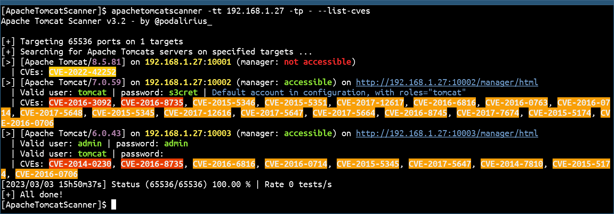

<p align="center">
  A python script to scan for Apache Tomcat server vulnerabilities.
  <br>
  
  
  
  <a href="https://twitter.com/intent/follow?screen_name=podalirius_" title="Follow"></a>
  <a href="https://www.youtube.com/c/Podalirius_?sub_confirmation=1" title="Subscribe"></a>
  <br>
</p>

## Features

 - [x] Multithreaded workers to search for Apache tomcat servers.
 - [x] Multiple target source possible:
   - [x] Retrieving list of computers from a Windows domain through an LDAP query to use them as a list of targets.
   - [x] Reading targets line by line from a file.
   - [x] Reading individual targets (IP/DNS/CIDR) from `-tt/--target` option. 
 - [x] Custom list of ports to test.
 - [x] Tests for `/manager/html` access and default credentials.
 - [x] List the CVEs of each version with the `--list-cves` option


## Installation

You can now install it from pypi (latest version is ) with this command:

```
sudo python3 -m pip install apachetomcatscanner
```

## Usage

```
$ ./ApacheTomcatScanner.py -h
Apache Tomcat Scanner v2.3.2 - by @podalirius_

usage: ApacheTomcatScanner.py [-h] [-v] [--debug] [-C] [-T THREADS] [-s] [--only-http] [--only-https] [--no-check-certificate] [--xlsx XLSX] [--json JSON] [-PI PROXY_IP] [-PP PROXY_PORT] [-rt REQUEST_TIMEOUT] [-tf TARGETS_FILE]
                              [-tt TARGET] [-tp TARGET_PORTS] [-ad AUTH_DOMAIN] [-ai AUTH_DC_IP] [-au AUTH_USER] [-ap AUTH_PASSWORD] [-ah AUTH_HASH]

A python script to scan for Apache Tomcat server vulnerabilities.

optional arguments:
  -h, --help            show this help message and exit
  -v, --verbose         Verbose mode. (default: False)
  --debug               Debug mode, for huge verbosity. (default: False)
  -C, --list-cves       List CVE ids affecting each version found. (default: False)
  -T THREADS, --threads THREADS
                        Number of threads (default: 5)
  -s, --servers_only    If querying ActiveDirectory, only get servers and not all computer objects. (default: False)
  --only-http           Scan only with HTTPs scheme. (default: False, scanning with both HTTP and HTTPs)
  --only-https          Scan only with HTTP scheme. (default: False, scanning with both HTTP and HTTPs)
  --no-check-certificate
                        Do not check certificate. (default: False)
  --xlsx XLSX           Export results to XLSX
  --json JSON           Export results to JSON

  -PI PROXY_IP, --proxy-ip PROXY_IP
                        Proxy IP.
  -PP PROXY_PORT, --proxy-port PROXY_PORT
                        Proxy port
  -rt REQUEST_TIMEOUT, --request-timeout REQUEST_TIMEOUT

  -tf TARGETS_FILE, --targets-file TARGETS_FILE
                        Path to file containing a line by line list of targets.
  -tt TARGET, --target TARGET
                        Target IP, FQDN or CIDR
  -tp TARGET_PORTS, --target-ports TARGET_PORTS
                        Target ports to scan top search for Apache Tomcat servers.
  -ad AUTH_DOMAIN, --auth-domain AUTH_DOMAIN
                        Windows domain to authenticate to.
  -ai AUTH_DC_IP, --auth-dc-ip AUTH_DC_IP
                        IP of the domain controller.
  -au AUTH_USER, --auth-user AUTH_USER
                        Username of the domain account.
  -ap AUTH_PASSWORD, --auth-password AUTH_PASSWORD
                        Password of the domain account.
  -ah AUTH_HASH, --auth-hash AUTH_HASH
                        LM:NT hashes to pass the hash for this user.
```

## Example


You can also list the CVEs of each version with the `--list-cves` option:



## Contributing

Pull requests are welcome. Feel free to open an issue if you want to add other features.
